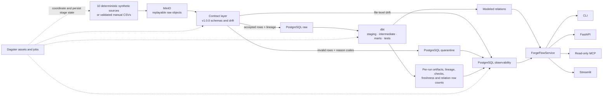
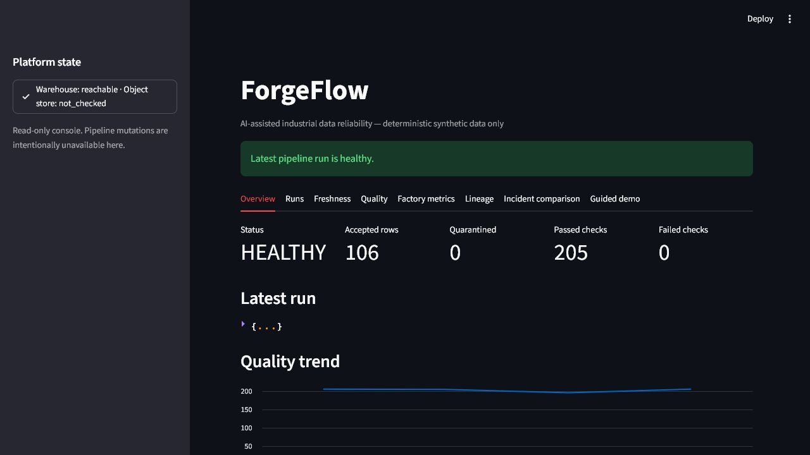
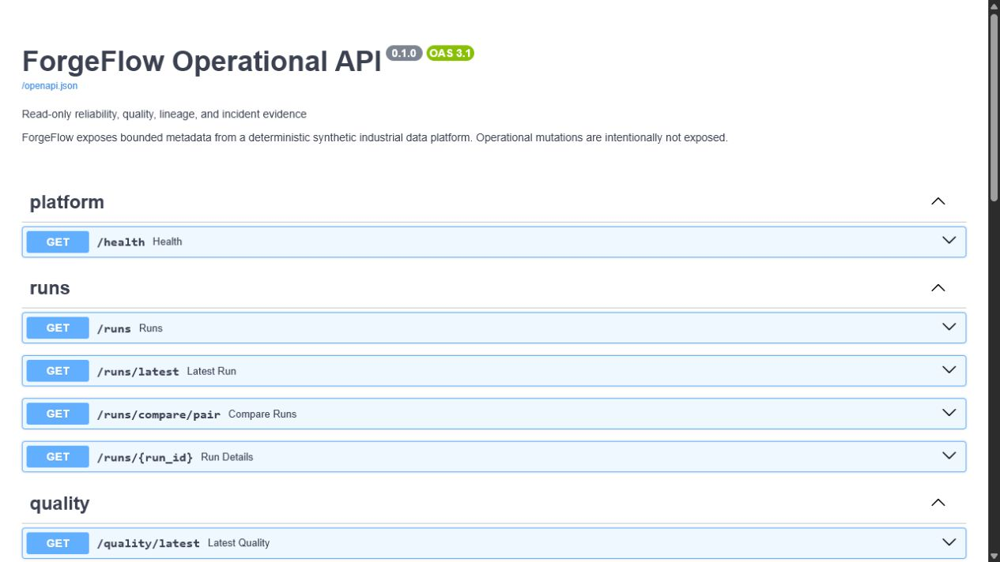

# ForgeFlow

**A local-first, AI-assisted industrial data reliability platform built entirely from deterministic synthetic data.**

ForgeFlow demonstrates the engineering around an analytical pipeline when input is duplicated,
late, structurally different, or wrong. It preserves source objects, validates versioned contracts,
quarantines invalid rows, builds a PostgreSQL warehouse with dbt, records failure evidence, and
recovers without rewriting the incident history.

This is a laptop-scale portfolio system, not a production service. It uses no real industrial,
personal, employer, customer, or university data.

## What is verified

The latest locally verified demo sequence exercises one continuous path through PostgreSQL, MinIO,
contracts, dbt, observability, incident creation, and recovery:

| Run | Accepted | Quarantined | Failed checks | Skipped files | Final state |
|---|---:|---:|---:|---:|---|
| Healthy baseline | 1,399 | 0 | 0 | 0 | `healthy` |
| Exact replay | 0 | 0 | 0 | 10 | `healthy` |
| Controlled incident | 95 | 23 | 5 | 3 | `failed` |
| Explicit recovery | 106 | 0 | 0 | 4 | `healthy`, incident resolved |

The recovery run is bound to the incident it resolves. The failed run, quarantine records, source
objects, checks, and explanation remain queryable afterward.

Latest local verification:

- 226 non-integration tests passed and 1 Windows-only symlink test was skipped;
- 2 PostgreSQL/MinIO/dbt integration tests passed, covering the lifecycle and atomic rollback/retry;
- 87.44% configured branch coverage for the core package;
- Ruff formatting and linting, strict Mypy, Bandit, and `pip-audit` passed.

The repository includes a GitHub Actions workflow for the same quality and container-integration
paths. No remote workflow result or badge is claimed here.

## Architecture



PostgreSQL is the system of record for accepted data and operational evidence; MinIO keeps the
replayable source objects. Dagster coordinates the same framework-independent pipeline services.
FastAPI, MCP, CLI status views, and Streamlit all reuse `ForgeFlowService` rather than implementing
separate query or incident logic.

## Reliability controls

| Concern | Implementation |
|---|---|
| Source identity | SHA-256 content identity plus a separate domain-event identity |
| Replay | Identical source/checksum pairs are skipped without increasing accepted facts |
| Raw retention | Generator objects and validated `run-batch` CSVs are landed before contract decisions |
| Contracts | Ten source contracts, currently version `1.0.0`, cover shape, type, nullability, enum, range, time, key, and reference rules |
| Bad data | Row failures retain source lineage and stable reason codes in quarantine; file drift is persisted separately |
| Updates | Source `updated_at` ordering prevents older source rows from replacing newer state |
| Late data | Event and ingestion timestamps are distinct; dbt uses a documented incremental lookback and bounded backfill variables |
| Anomalies | Source volume uses at least three comparable healthy runs, a median baseline, and the greater of a 20% floor or three scaled MADs |
| dbt evidence | Isolated per-run target directories; required artifacts, tests, freshness, lineage, and actual relation row counts are captured |
| Failure handling | Pipeline stages persist status, timing, counts, metadata, and safe errors; run finalization continues after dbt failure |
| Recovery | A recovery run must name the open incident it resolves; healthy unrelated work cannot close it |
| Explanation | Offline deterministic evidence is the default; optional OpenAI wording uses the same typed, bounded facts/hypotheses/next-steps schema |
| Read surfaces | Typed and bounded API/MCP/service queries omit quarantined payloads and arbitrary SQL |

The synthetic domain covers factories, production lines, machines, shifts, production orders,
machine telemetry, downtime, maintenance work orders, quality inspections, and product defects.

## Quick start

Prerequisites: Python 3.12, [uv](https://docs.astral.sh/uv/), and Docker with Compose v2.

Copy the local-only example environment if you want to override the safe defaults:

```powershell
Copy-Item .env.example .env
```

```bash
cp .env.example .env
```

Install the locked environment and start PostgreSQL and MinIO:

```text
uv sync --locked --all-groups
uv run poe up
```

Run the healthy baseline and exact replay:

```text
uv run poe demo
```

`demo` deliberately requires a newly accepted ten-file baseline; it will not relabel an existing
all-duplicate replay as a baseline. If this deterministic batch is already in the ledger, run the
guarded `uv run poe reset` first and confirm the displayed repository-owned deletion target.

Run the controlled incident, then the incident-bound recovery:

```text
uv run poe incident-demo
uv run poe recover-demo
```

The incident command succeeds only when the named failure produces quarantined rows, failed checks,
schema-change evidence, downstream impact, and a persisted incident ID. Recovery succeeds only when
the same incident is linked to a clean healthy run. The compact outcome shape is:

```json
{
  "run": {
    "status": "failed",
    "quarantined_row_count": 23,
    "failed_checks": 5
  },
  "incident_id": "<persisted UUID>",
  "summary": {
    "observed_facts": ["..."],
    "likely_explanations": [],
    "recommended_next_steps": ["..."]
  }
}
```

The run summary intentionally does not infer causation. The persisted incident endpoint and MCP
handoff add explicitly labeled, evidence-derived hypotheses after the run itself is durable.

Inspect current dependency and run state:

```text
uv run forgeflow status
```

Stop the infrastructure when finished:

```text
uv run poe down
```

`forgeflow clean` is intentionally interactive and only permits the configured local `forgeflow`
database plus repository-owned generated files. MinIO objects and Docker volumes are retained.

## Reviewer surfaces

With data loaded, start the HTTP API or dashboard in separate terminals:

```text
uv run forgeflow-api
uv run forgeflow-dashboard
```

- OpenAPI: <http://127.0.0.1:8000/docs>
- Dashboard: <http://127.0.0.1:8501>
- MCP stdio server: `uv run forgeflow-mcp`
- Dagster UI: `uv run dagster dev -w workspace.yaml`

The FastAPI surface is read-only and includes runs, comparisons, quality, quarantine metadata,
freshness, model metadata, lineage, incident evidence, and engineering handoffs. The MCP server
offers the same bounded investigation concepts as tools and JSON resources; it exposes no mutation
tool.

Example API reads after starting `forgeflow-api`:

```text
curl http://127.0.0.1:8000/health
curl "http://127.0.0.1:8000/runs?limit=5&offset=0"
curl http://127.0.0.1:8000/quality/latest
```

An MCP client can launch the stdio server from the repository root with equivalent configuration:

```json
{
  "mcpServers": {
    "forgeflow": {
      "command": "uv",
      "args": ["run", "forgeflow-mcp"],
      "cwd": "<absolute path to this repository>"
    }
  }
}
```

Useful investigation tools include `list_pipeline_runs`, `compare_pipeline_runs`,
`list_quarantined_records`, `get_downstream_impact`, `explain_incident_evidence`, and
`generate_engineering_handoff`. See [the MCP catalog and safety model](docs/mcp.md) for every tool,
resource, bound, and error behavior.

### Dashboard



### OpenAPI



## Verification and development

Use Poe task names on every platform:

| Command | Purpose |
|---|---|
| `uv run poe check` | Formatting, Ruff, strict Mypy, coverage, Bandit, and dependency audit |
| `uv run poe test` | Unit suite |
| `uv run poe integration` | Full path in the dedicated local `forgeflow_test` database plus MinIO |
| `uv run poe dbt-compile` | Compile the dbt project |
| `uv run poe dbt-test` | Run dbt tests against the configured target |
| `uv run poe docs` | Generate dbt manifest and catalog documentation |
| `uv run poe dagster-validate` | Load and validate Dagster definitions/workspace configuration |

The CI definition lives at [`.github/workflows/ci.yml`](.github/workflows/ci.yml). It uses a locked
Python environment, read-only repository permissions, pinned actions, secret scanning, the quality
gate, container services, the integration suite, the healthy demo, and dbt validation.

## Repository map

| Path | Purpose |
|---|---|
| `src/forgeflow/` | Typed generator, contracts, pipeline, warehouse, dbt boundary, service, API, MCP, dashboard, CLI, and Dagster definitions |
| `dbt/` | Sources, staging/intermediate/mart models, snapshot, macros, tests, exposures, and descriptions |
| `infra/postgres/init/` | Idempotent warehouse/metadata schemas and the local read-only role |
| `tests/unit/` | Domain, safety, API, MCP, orchestration-boundary, and failure-path tests |
| `tests/integration/` | Real PostgreSQL, MinIO, dbt, incident, and recovery acceptance path in `forgeflow_test` |
| `docs/` | Architecture, contracts, metrics, observability, security, operations, production guidance, and ADRs |
| `.github/workflows/ci.yml` | Pinned quality and container-integration workflow |
| `STATUS.md` | Exact locally verified commands, results, blocked evidence, and acceptance status |

## Security posture

ForgeFlow treats every source row and model description as untrusted data. SQL is parameterized;
manual files and reviewer payloads are bounded; raw quarantine payloads are omitted from API/MCP;
MCP has no mutation tools; app containers use a read-only PostgreSQL role, dropped capabilities,
read-only filesystems, and loopback ports. Local credentials are public demo values, not secrets.
Bandit and `pip-audit` run locally, while CI additionally scans Git history. These controls reduce
risk for a local demonstration; they do not provide production identity, tenant isolation, TLS, or
an audited security boundary. The concrete abuse cases and residual risks are in the
[threat model](docs/threat-model.md).

## Documentation

- [Architecture and invariants](docs/architecture.md)
- [Data model and metric grains](docs/data-model.md)
- [Contracts, drift, and quarantine](docs/data-contracts.md)
- [Observability and incident evidence](docs/observability.md)
- [MCP tools and resources](docs/mcp.md)
- [Demo walkthrough](docs/demo-walkthrough.md)
- [Threat model](docs/threat-model.md)
- [Production considerations](docs/production-considerations.md)
- [Troubleshooting](docs/troubleshooting.md)
- [Portfolio and interview material](PORTFOLIO.md)

## Honest limitations

- ForgeFlow is a single-user, laptop-scale portfolio system. It has no production authentication,
  authorization, TLS, managed secrets, network policy, rate limiting, HA, DR, or audited operations.
- Compose uses fixed, documented demo credentials bound to loopback. They must never be reused or
  exposed outside an isolated development machine.
- The file ledger identifies content globally by source and checksum. A later delivery of identical
  bytes appears as a skip in a new run, not as a distinct delivery-attempt entity; a production
  ledger should separate content identity from every delivery attempt.
- Some read views currently return an empty collection when a mart is unavailable, so an empty
  result cannot always distinguish “no data” from “model unavailable.”
- Exact-byte preservation applies to validated manual CSV input through `run-batch` and to the
  objects produced by the generator. Manual batch directories reject unregistered top-level CSV
  filenames before any file is read or landed. A caller that supplies only in-memory records
  without raw bytes gets a deterministic canonical CSV representation.
- The median/MAD volume rule is intentionally simple and has no seasonal model. Synthetic
  distributions do not establish real factory behavior, scale, or business impact.
- Processing is batch/incremental. Streaming is intentionally deferred.
- Optional external model use introduces privacy, availability, nondeterminism, and cost concerns;
  deterministic offline explanation remains the default.

See [production considerations](docs/production-considerations.md) for the work required to turn the
reference architecture into an operated platform.

## Recommended future work

The next useful engineering step is a separate append-only delivery-attempt ledger with durable
stale-run reconciliation and crash-injection tests across the object-store/database boundary. After
that, production evolution would add identity and authorization, managed secrets/object storage,
encrypted transport, alerting/SLOs, immutable audit retention, backup/restore drills, and controlled
cloud deployment. Streaming remains intentionally outside the core until those reliability
boundaries are justified and measured.
