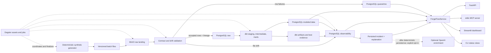

# Architecture

## Scope and evidence status

This document records ForgeFlow's implemented local architecture and the invariants it preserves. It
is not execution evidence: `STATUS.md` records the commands and tests exercised for the current tree.

ForgeFlow is deliberately a local portfolio platform, not a production-ready service. Its value is
the coherence of one reliability workflow, not the number of deployed components.

## Architectural invariants

1. The main path stays `synthetic sources -> MinIO -> contracts -> PostgreSQL -> dbt -> Dagster ->
   observability -> read surfaces`.
2. MinIO preserves replayable source objects. PostgreSQL is the system of record for accepted data,
   quarantine evidence, warehouse models, and operational metadata.
3. Row-level contract failures go to quarantine. File-level drift is a separate observation. Raw
   input is never silently discarded.
4. API, MCP, CLI status views, and dashboard queries go through `ForgeFlowService`; each surface
   must not invent its own status, incident, or lineage logic.
5. A failed transformation is still an observable run. Run finalization and dbt artifact parsing
   execute even when dbt returns a failure.
6. API, dashboard, and MCP are read-only surfaces. The current MCP server registers no mutation
   tools; `FORGEFLOW_ENABLE_WRITES` is reserved for a future explicitly implemented write boundary.
7. Incident explanations may organize recorded evidence, but they cannot authorize a repair or
   promote a hypothesis to a confirmed cause.

## System context

Dashed lines show control or optional flows; solid lines show durable data and query flows. Dagster
does not become another system of record: it coordinates work while ForgeFlow persists reviewer-
facing run evidence in PostgreSQL and JSON artifacts. Incident creation first writes the
deterministic explanation; optional OpenAI enrichment may replace only that explanation. API, MCP,
dashboard, and service reads return the persisted value and never invoke an explanation provider.

## Component responsibilities

| Component | Owns | Must not own |
|---|---|---|
| Synthetic generator | Seeded domain records, clean/incremental/incident/recovery fixtures | Real industrial or personal data; hidden random failures |
| MinIO | Exact validated manual CSV or canonical generated objects, content identity, replay input | Accepted-row state or final run status |
| Contract layer | Version `1.0.0` file shape classification, row validation, readable reason codes | Downstream business aggregates; silent repair of invalid values |
| PostgreSQL | Ingestion ledger, warehouse layers, quarantine, quality/run/incident metadata | Unbounded raw payload delivery to clients |
| dbt | SQL transformations, tests, freshness, descriptions, lineage artifacts | Source landing, operational repair, explanation authority |
| Dagster | Dependency readiness retries, daily job/schedule, healthy-only success propagation | A second durable definition of run health or automatic resume of failed runs |
| `ForgeFlowService` | Bounded queries over persisted status, comparisons, incident evidence assembly | Pipeline state derivation or transport-specific response logic |
| FastAPI | Validated HTTP transport and OpenAPI | Independent SQL or incident rules |
| MCP | Compact AI-client tools/resources with no mutation tools | Arbitrary SQL, raw table dumps, implicit mutations |
| Streamlit | Human-facing operational views and demo states | A separate metric calculation layer |
| Explanation providers | Facts/hypotheses/next-step presentation from an evidence bundle | Unsupported root-cause claims or automatic authorization |

## End-to-end control flow

| Step | Durable output | Failure behavior |
|---:|---|---|
| 0. Manual CLI preflight | None; bounded files are resolved, read once, and parsed | Unsafe/unparseable manual files fail explicitly without a run or object |
| 1. Start run | `running` run record with run ID, batch ID, scenario, start time | A failure to create the record stops processing; there is no untracked run |
| 2. Generate | Persisted `source_generation` stage metadata for generated runs; manual runs already have parsed records/exact bytes | Generator failures finalize the tracked run |
| 3. Land | Exact validated manual bytes or canonical generated CSV, plus checksum/file metadata | A terminal identical checksum is skipped; a failed/nonterminal file identity is reset and retried |
| 4. Validate | Contract result, drift observations, accepted rows, row reasons | A missing required column yields breaking drift and quarantines affected rows; invalid rows are retained with all reasons |
| 5. Load | Accepted current-state rows, quarantine rows, drift, and file status with lineage | Each repository call is transactional; a later source-step failure marks the file retryable and the run failed, then idempotent retry reconciles it |
| 6. Transform/test | dbt invocation, isolated per-run artifact directory, and advisory lock | Preserve a non-zero result and continue artifact parsing/finalization; serialize local relation mutations |
| 7. Observe | Persisted stage rows, normalized checks, freshness, actual relation counts, lineage impact, comparison evidence | Successful dbt processes without required artifacts fail the run instead of producing empty success |
| 8. Finalize | Final state, finish time, duration, counts, summary, error context | Protected success/failure paths attempt finalization without changing the primary failure into success |

Retries are reserved for transient, idempotent I/O. Dagster retries dependency readiness; it does not
blindly retry deterministic contract or dbt test failures. The file ledger permits a later run to
resume a `failed` or nonterminal content identity.

## Identity and lineage

The identifiers answer different questions and must not be conflated:

| Identifier | Meaning | Stability |
|---|---|---|
| `run_id` | One orchestration attempt | New UUID for every attempt |
| `batch_id` | One logical source delivery/scenario | Stable across a deliberate rerun of the same batch |
| `source_file_id` | One content-ledger record for `(source, checksum)` | Reused for a failed/nonterminal retry; terminal duplicates do not create an attempt row |
| `checksum` | Content identity | Same bytes produce the same value |
| Domain event ID | Source-level business/event identity | Used to detect duplicates across files/batches |
| `incident_id` | Investigation spanning failed and recovery runs | Stable through recovery; failed-run evidence is retained while explanation/status/linkage may update |

Every accepted row carries `_batch_id`, `_source_file_id`, `_source_row_number`, `_ingested_at`, and
`_record_checksum`. Quarantine records keep run/file/row traceability plus one or more structured
reasons. Raw payload access is an internal diagnostic capability and is not returned by default
through API or MCP.

“Immutable” is an application invariant locally: content-addressed keys are not deliberately edited
or deleted during processing/recovery. The Compose MinIO bucket is not claimed to enforce WORM or a
regulatory retention lock; production immutability needs storage policy and separate privileges.

## Run-state semantics

Final state is derived centrally after all available evidence has been collected:

| State | Meaning |
|---|---|
| `running` | A final state has not yet been persisted. It is never a successful terminal state. |
| `healthy` | Required stages and error-severity checks passed, with no quarantined rows. |
| `degraded` | Processing completed, but quarantine or warning-level freshness/anomaly evidence exists. |
| `failed` | Infrastructure, transformation, finalization, or error-severity quality evidence prevents a healthy result. |

Precedence is `failed` over `degraded` over `healthy`. A dbt failure cannot be hidden by a later
successful metadata write. Conversely, a failed run must still expose whatever counts, artifacts,
and impact were collected before the failure.

## Local deployment topology

Docker Compose provides loopback-bound PostgreSQL and MinIO services and optional application
containers. Compose injects only the explicit local `forgeflow_reader` database URL and bind settings
into API/dashboard: it does not load `.env` or inject MinIO/OpenAI credential variables, and those
processes do not build an object-store client.
Their PostgreSQL role has `SELECT` on `observability`, `quarantine`, and `marts`; it cannot mutate
warehouse state. Local Python processes may run the CLI, Dagster, MCP stdio server, API, and dashboard.
The repository-scoped `.forgeflow/` directory holds generated working files and exported artifacts;
it is disposable runtime state, not a second source of record.

Default local credentials, including the reader password, are synthetic and intentionally
documented. They are unsuitable outside an isolated developer machine. Production boundaries and
Azure alternatives are described in
[production considerations](production-considerations.md); concrete threats are tracked in the
[threat model](threat-model.md).

## Why these components

The decisions are kept in concise ADRs rather than repeated here:

- [ADR-001: PostgreSQL](decisions/001-postgresql-system-of-record.md)
- [ADR-002: MinIO](decisions/002-minio-raw-landing.md)
- [ADR-003: Dagster](decisions/003-dagster-orchestration.md)
- [ADR-004: dbt](decisions/004-dbt-transformations.md)
- [ADR-005: deterministic explanations](decisions/005-deterministic-explanations.md)
- [ADR-006: no core streaming](decisions/006-defer-streaming.md)
- [ADR-007: shared service layer](decisions/007-shared-service-layer.md)
- [ADR-008: finalize failed runs](decisions/008-finalize-failed-runs.md)
- [ADR-009: Poe task contract](decisions/009-poe-cross-platform-tasks.md)
- [ADR-010: optional OpenAI provider](decisions/010-optional-openai-provider.md)

## Current local limits

- The content ledger deduplicates bytes but is not an append-only record of every delivery attempt.
- The PostgreSQL advisory lock serializes ForgeFlow dbt runs that use the same database/key; it is not
  a distributed orchestration or admission-control system.
- The generated/manual CSV paths read bounded files into memory; there is no streaming parser.
- Raw tables are current-state upserts. Prior source bytes remain in MinIO, but row versions other
  than the machine dbt snapshot are not modeled as temporal facts.
- Accepted rows, quarantine rows, drift evidence, and file completion are committed in one
  per-source PostgreSQL transaction. Object landing, ledger registration, and the complete
  multi-source batch are not a distributed transaction; failed-file state plus idempotent retry is
  still the reconciliation mechanism across those boundaries.
- Local credentials, loopback binding, and a read-only database role are defense in depth for one
  developer, not authentication or tenant isolation.

## Verification contract

Architecture is demonstrated only when the evidence ledger in `STATUS.md` records all of the
following: a clean bootstrap, healthy run, identical rerun without duplicate accepted rows,
intentional incident, retained dbt failure artifacts, bounded API/MCP reads, and healthy recovery
without deleting failed-run evidence. Diagrams and code structure alone do not satisfy that bar.
