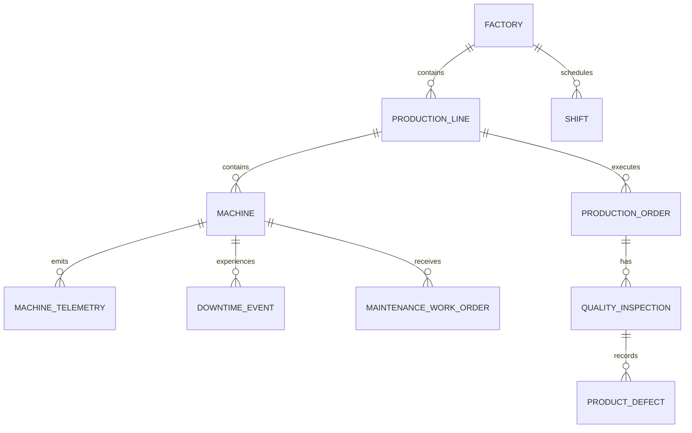

# Data model

## Scope and evidence status

This document defines domain grains, keys, warehouse layering, history behavior, and analytical
metric semantics. Column-level ingestion rules belong in [data contracts](data-contracts.md), while
quality-result semantics belong in [observability](observability.md).

The relations and calculations below match the current dbt project and ingestion schema. Command and
test results in `STATUS.md`, rather than this catalog, determine what has been exercised.

## Domain spine

All operator identifiers are deterministic anonymous synthetic values. There are no employee,
customer, university, or production-system identifiers.

## Source entity grains

| Entity | Grain | Natural identifier | Parent reference | Principal event time |
|---|---|---|---|---|
| Factory | One synthetic site | `factory_id` | None | None |
| Production line | One line within a factory | `production_line_id` | `factory_id` | None |
| Machine | One installed machine | `machine_id` | `production_line_id` | `installed_on` |
| Shift | One scheduled factory time window | `shift_id` | `factory_id` | `started_at`, `ended_at` |
| Production order | One order assigned to a line | `production_order_id` | `production_line_id` | planned and actual start/end |
| Machine telemetry | One observation from one machine | `telemetry_id` | `machine_id` | `event_timestamp` |
| Downtime event | One continuous machine outage | `downtime_event_id` | `machine_id` | `started_at`, `ended_at` |
| Maintenance work order | One maintenance request/lifecycle | `maintenance_work_order_id` | `machine_id` | created/scheduled/completed timestamps |
| Quality inspection | One inspection event for an order | `quality_inspection_id` | `production_order_id` | `inspected_at` |
| Product defect | One classified defect record within an inspection | `product_defect_id` | `quality_inspection_id` | `detected_at` |

Natural identifiers detect source duplicates and remain the warehouse business keys. dbt snapshot
metadata supplies technical version identity where needed; it does not replace the source ID.

## Warehouse layers

| Schema | Purpose | Allowed transformations |
|---|---|---|
| `raw` | Accepted source rows plus ingestion lineage | Validated/normalized monotonic business-key upsert; no aggregation |
| `staging` | Typed source projections | Explicit casts and column descriptions; no business aggregation |
| `intermediate` | Reusable joins, intervals, and event preparation | Business logic with documented grain |
| `marts` | Reviewer-facing dimensions, facts, and metrics | Stable business definitions and bounded dimensions |
| `observability` | Runs, files, checks, freshness, drift, lineage, incidents | Operational metadata only |
| `quarantine` | Invalid source rows and structured reasons | No promotion without a new validated processing attempt |

Business dimensions/facts do not query quarantine or observability. The explicit operational
exception is `mart_data_quality_trends`, which aggregates `observability.quality_results` for a
reviewer-facing trend. No accepted business fact depends on that mart, and no model queries raw
quarantine payloads. Observability can read model outputs to calculate counts and freshness.

## Target analytical relations

These are dbt resource names and grains. `mart_factory_performance` is published as
`marts.factory_performance`, and `mart_data_freshness` as `marts.data_freshness`, for stable service
queries. ForgeFlow derives the physical identifier from each manifest node rather than assuming the
dbt resource name is the relation alias.

| Relation | Grain | Main purpose |
|---|---|---|
| `dim_factory` | One current factory | Site attributes and rollups |
| `dim_production_line` | One current line | Factory-to-line navigation |
| `dim_machine` | One current machine | Current machine plus line/factory context |
| `machine_history` snapshot | One machine version | dbt timestamp-strategy SCD Type 2 history keyed by `machine_id` and `updated_at` |
| `fct_machine_telemetry_daily` | One machine and event date | Daily measurement summaries, late-arrival count, and latest event/ingest times |
| `fct_production_output` | One production order | Planned/actual quantity, variance, attainment, timing, and status |
| `fct_downtime` | One downtime event | Planned/unplanned duration, reason, open state, and breakdown classification |
| `fct_quality_inspections` | One inspection | Sample counts, result, defect occurrences/categories, and sampled defect rate |
| `mart_factory_performance` | One factory over loaded history | Output/target, inspection, sampled defects, and downtime indicators |
| `mart_downtime_by_reason` | Factory, line, downtime type, and reason | Event counts, hours, average duration, open count |
| `mart_machine_reliability` | One current machine over loaded history | Breakdown, resolved MTTR, MTBF, downtime, telemetry, and stale indicators |
| `mart_maintenance_backlog` | One currently open/in-progress work order | Backlog age, priority, scheduled time, and overdue state |
| `mart_inspection_outcomes` | Factory and inspection date | Inspection/sample/failure/defect totals and sampled defect rate |
| `mart_data_freshness` | One source | Latest ingest/event times, ages, and freshness state |
| `mart_data_quality_trends` | Quality date, check type, and scope | Pass/fail/warning/error check counts |

`shifts` is contracted and staged but is not promoted to a dedicated mart in the current model. That
avoids implying shift-performance attribution before events have an explicit, tested interval join
to a shift.

## Ingestion lineage columns

Every accepted raw row has the following technical columns in addition to source fields:

| Column | Meaning |
|---|---|
| `_batch_id` | Logical delivery that contained it |
| `_source_file_id` | Ingestion-ledger identity of its object |
| `_source_row_number` | One-based source position including the header convention documented by the loader |
| `_ingested_at` | UTC warehouse load time |
| `_record_checksum` | Canonical content checksum used for row identity/change reasoning |

Source `event_timestamp` (or the source-specific business timestamp) and ingestion `_ingested_at`
answer different questions and must both be kept. The first supports event-time analysis; the second
supports arrival lag and replay audits. The file ledger links `_source_file_id` to its processing run.

## History, duplicates, and late arrivals

### Machine history

Mutable machine attributes use dbt's timestamp-strategy `machine_history` snapshot keyed by
`machine_id` and ordered by source `updated_at`; dbt supplies the validity metadata. A replay with an
unchanged update timestamp does not create a new logical change. `dim_machine` remains the
current-state dimension.

### Event deduplication

An exact source/checksum match prevents a second file load. Within one source delivery, the first
valid natural ID is eligible for acceptance and a repeated ID is quarantined with
`duplicate_identifier`. Across accepted files, the raw table uses the natural business key. Unchanged
record checksums cause no update. Changed content updates the current raw row and its ingestion
lineage only when incoming `updated_at` is equal to or newer than the stored value; older deliveries
cannot roll state backward. Prior bytes remain replayable in MinIO and prior file/run evidence remains
in observability; the raw relation itself is current-state, not an append-only event-version table.

The file ledger is content-oriented, not attempt-oriented. A terminal duplicate does not create a
new `source_files` row, and a retry of a failed/nonterminal identity reuses the row and moves its
run/batch association. Run-level skipped counts and quality evidence still identify the replay, but
the model does not claim an append-only record of every transport attempt.

### Late-arriving events

`int_machine_telemetry` is incremental with `telemetry_id` as its unique key, `delete+insert`
semantics, a 48-hour event-time lookback by default, and explicit `backfill_start`/`backfill_end`
overrides. A valid late event is accepted and marked with arrival lag; arrivals over 24 hours are
flagged late. Future-dated events beyond the contract tolerance fail validation.

The current telemetry join enriches facts with current machine context; it does not yet join to the
machine snapshot version valid at event time. Historical-as-of attribution is therefore a documented
gap and must not be implied by the presence of `machine_history` alone.

## Observed model row counts

After dbt and manifest parsing, ForgeFlow counts the actual current rows in up to 100 whitelisted
manifest-declared model relations in `staging`, `intermediate`, and `marts`. The run summary keys
these counts by dbt model name. A missing relation/count is omitted and comparisons mark a model
unavailable when only one side has a count; adapter `rows_affected` is not presented as a relation
row count.

## Metric definitions

These definitions prevent similarly named but materially different calculations. SQL models must
document denominator exclusions and UTC/reporting-time-zone conversion.

| Metric | Definition | Guardrails |
|---|---|---|
| Order output | `actual_quantity` for one production order | Reported output, not inferred telemetry production |
| Order quantity variance | `actual_quantity - planned_quantity` | Positive means over plan; it is not a percentage |
| Order target attainment | `actual_quantity / planned_quantity` | Null at zero (although contract requires plan >= 1); do not cap above 1 |
| Factory output / target | Sums of actual / planned quantity for non-cancelled orders | Current mart covers loaded history unless a consumer adds a period filter |
| Downtime duration | Minutes from `started_at` through `ended_at`, or current time while open | Open duration is time-dependent, not a historical snapshot |
| Unplanned downtime hours | Sum of unplanned downtime minutes divided by 60 | Current model does not clip overlaps or scheduled windows |
| Breakdown count | Events with type `unplanned` and reason `breakdown` | Other unplanned reasons remain downtime but not failures for this metric |
| Resolved breakdown count | Breakdown events whose `ended_at` is non-null | Exposed so the MTTR denominator is reviewable |
| MTBF | Average hours from the prior completed breakdown's end to the next breakdown's start | First failure and a failure after an open predecessor return null |
| MTTR | Average repair hours for resolved breakdowns | Open breakdowns are excluded and reported separately |
| Maintenance backlog | Work orders currently `open` or `in_progress` | Current-state view, not reconstructable historical backlog |
| Backlog age | `(current_timestamp - created_at)` in days per backlog row | Time-dependent; future creation fails the contract |
| Inspected units | Sum of inspection `sample_size` | Do not substitute total production without an inspection-coverage model |
| Sampled defect rate | `failed_units / sample_size`, aggregated as sum failed / sum sample | Inspected sample only; null at zero |
| Defect occurrences | Sum of categorized `defect_count` | Separate from failed units because categories can be multi-label |
| Source freshness | Latest ingestion age: `fresh` <= 24h, `warning` <= 72h, then `stale` | Event age is exposed separately; these are demo defaults |
| Machine telemetry staleness | Latest event missing or older than configured 6 hours | Evaluated at build time; a future event cannot create false freshness |
| Arrival lag | `_ingested_at - event_timestamp` in hours | Over 24 hours is flagged late; daily fact exposes a count |
| Quality check pass rate | Passed divided by passed plus failed checks | Warnings and check population are reported separately |
| Quarantine rate | Quarantined rows divided by evaluated source rows | Missing-column rows are enumerable/quarantined; unreadable files are file failures |

Availability and OEE are intentionally not calculated: the model lacks tested scheduled-runtime,
speed-performance, and unit-quality denominators. MTBF/MTTR are simplified synthetic indicators and
must not be compared across sites without compatible windows and failure taxonomy.

## Required integrity tests

At minimum, dbt/contract coverage must verify unique and non-null natural IDs, parent references,
nonnegative quantities, valid intervals, reconciled inspection counts, the 150%-of-plan business
limit, one history stream per machine key, and no duplicate event IDs in reviewer-facing facts.
Evidence is a dbt/test result, not the presence of YAML alone.
