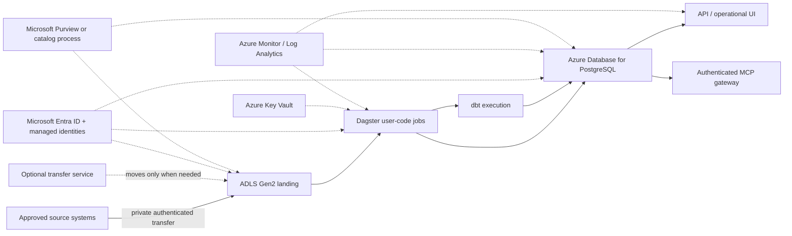

# Production considerations

## Position

ForgeFlow is a local portfolio reference system. It is not production ready, and this document is not
a deployment claim or an infrastructure plan approved for any organization. It identifies the work
needed to preserve the useful design ideas under real security, scale, reliability, governance, and
cost constraints.

No Azure resources are provisioned by this repository. Service selection would require measured
workload, organizational standards, regulatory needs, and an architecture review.

## First decision: should this become a product?

Before migration, validate ownership and operating need:

- who owns source contracts, failed data, and incident closure;
- which decisions depend on each metric and at what latency;
- source volume, cadence, retention, backfill, and concurrency;
- data classification, residency, legal basis, and deletion obligations;
- recovery objectives and allowed degraded modes;
- users, roles, approval paths, and audit requirements; and
- monthly cost envelope and support/on-call model.

If the need is only a daily batch for one team, a managed database, object store, scheduled container,
and small read API may remain more appropriate than a broad platform.

## Illustrative Azure target

This retains object storage, contracts, PostgreSQL, dbt, Dagster, and shared service semantics. It
does not require copying the local Compose topology one container at a time.

## Capability gaps and practical changes

| Concern | Local portfolio state | Production change |
|---|---|---|
| Authentication | Single trusted local user; loopback ports | Microsoft Entra ID/OIDC for humans; managed identities/workload identity for services |
| Authorization | API/dashboard use `forgeflow_reader`; MCP has no mutation tools; CLI/pipeline uses the owner role | Role- and resource-scoped policy, least-privilege roles for every process, approval for backfill/repair, separation of duties |
| Secrets | Documented local defaults; Compose does not inject `.env` or S3/OpenAI variables into API/dashboard | Key Vault, managed identity where possible, rotation, secret versioning, access audit; no secrets in deployment manifests |
| Transport | Local HTTP/stdio | TLS everywhere, private endpoints/VNet integration, certificate lifecycle, authenticated MCP transport or controlled local sidecar |
| Object storage | Content-addressed MinIO named volume without WORM; bounded manual CSV is parsed before landing | ADLS Gen2/Blob with quarantine landing, versioning/immutability, lifecycle, encryption, private endpoints, separate writer/reader roles |
| Warehouse | Single local PostgreSQL | Azure Database for PostgreSQL Flexible Server for compatible workloads; size from evidence, use HA/read replicas/partitioning/pooling as required |
| Analytical scale | Laptop-scale dbt on PostgreSQL | Benchmark first; separate operational metadata from a warehouse/lakehouse only when volume/concurrency justify it |
| Orchestration | Local Dagster process/jobs, persisted PostgreSQL stages, advisory-locked dbt, per-run artifacts | Containerized user code plus durable Dagster services on Container Apps or AKS, or a managed control plane; isolate run storage and compute |
| API/dashboard/MCP | Loopback, no auth | Private ingress or API gateway, Entra integration, authorization, rate limits, WAF where exposed, session/CORS/CSRF review |
| Metadata retention | Demo volumes/manual reset | Partition run/check tables, define online/archive/delete periods, object lifecycle, legal holds, vacuum/index maintenance |
| Audit | Application run evidence; content ledger does not retain every delivery attempt | Append-only delivery/action audit with actor, purpose, approval, before/after identity, centralized export and retention |
| Alerting | Reviewer inspects UI/CLI | Route actionable freshness/run/security alerts through Azure Monitor to owned channels with deduplication and escalation |
| SLOs | No achieved service levels claimed | Define user journeys, SLIs, targets, error budgets, measurement source, and review cadence with stakeholders |
| Disaster recovery | Named local volumes | Zone/region strategy, point-in-time restore, immutable object copies, infrastructure rebuild, restore drills, documented RPO/RTO |
| Schema governance | Explicit source contract `1.0.0` and dbt docs, but no negotiated registry/lifecycle | Named owners, compatibility policy, change review, producer CI, catalog integration, deprecation windows, lineage impact approval |
| AI explanation | Deterministic persisted default; optional 50 KB/1,200-token/30-second/`store=false` enrichment | Approved processor/model, data classification, residency/retention review, egress policy, budgets, monitoring, human accountability |
| Privacy | Synthetic data only | Classification, minimization, DPIA where applicable, residency, retention/deletion, access reviews, masking, subject rights process |
| Cost | Developer laptop | Tags, budgets, alerts, reserved/autoscaled compute choices, storage lifecycle, query/egress monitoring, per-domain/showback ownership |

## Azure service choices and tradeoffs

### Landing storage

ADLS Gen2 is the closest managed replacement for the MinIO replay boundary. Enable hierarchical
namespace only when directory semantics/analytics engines need it. Use deterministic object paths,
checksums, a separate ingestion ledger, and a compatible data-protection policy. Blob versioning is
not available on hierarchical-namespace accounts, so choose and test container-level immutability,
soft delete, or non-HNS versioning against the retention requirement rather than promising all three
together. Event Grid may notify orchestration, but notification delivery must not become content
identity; replay and deduplication still use the ledger/checksum.

### PostgreSQL and analytical growth

Azure Database for PostgreSQL Flexible Server preserves SQL/adapter portability and can hold
operational metadata plus modest analytics. Use connection pooling, workload roles, private access,
backup/PITR, HA, partitioning, and performance telemetry as justified.

If facts grow beyond PostgreSQL's economical scan/concurrency envelope, evaluate Fabric Warehouse,
Synapse, Databricks SQL, or another approved analytical store from workload tests. Keep operational
run/quarantine metadata transactional and define one authoritative source for each record. A new
warehouse is a migration decision, not a reason to duplicate truth casually.

### Dagster deployment

Separate the web UI/control plane, daemon/scheduler, run storage, and user-code compute. User code
should run with a dedicated managed identity, resource requests/limits, retries only at idempotent
boundaries, concurrency pools, and isolated per-run artifact paths. Azure Container Apps can suit a
small containerized footprint: continuously running Dagster/API components map to apps, while finite
batch executions may map to Container Apps jobs if the Dagster run-launcher integration and evidence
lifecycle are proven. Jobs do not provide ingress. AKS is justified only when organizational platform
needs and operational capacity warrant its complexity. Dagster Cloud is another governance/
procurement decision, not a repository assumption.

### CI/CD and artifact supply chain

- Build once, scan, sign, and promote immutable images through environments.
- Store images in Azure Container Registry; deploy by digest.
- Use GitHub Actions OIDC/workload federation instead of long-lived cloud credentials.
- Require pull-request checks, protected environments, approvals for production, and migration
  rollback plans.
- Generate an SBOM, audit dependencies/images/actions, and review exceptions with expiry/owner.
- Run backward-compatible schema migrations before code that needs them; destructive changes use a
  staged expand/migrate/contract process.

## SLO design

Targets must come from business consequences, not from what sounds impressive. Candidate SLIs are:

| User journey | SLI | Required definition before target |
|---|---|---|
| Daily data available | Percentage of scheduled batches whose required marts are healthy by deadline | Schedule, deadline, exclusions, late-source ownership |
| Evidence complete | Percentage of terminal runs with final metadata and required artifacts | Required fields/artifacts and reconciliation policy |
| Fresh data | Percentage of critical source-scopes below configured freshness threshold | Cadence, grace, business calendar, source criticality |
| Investigation read | Availability/latency of bounded run/check queries | Authenticated endpoint, payload size, percentile/window |
| Recovery | Time from acknowledged incident to verified healthy current state | Start/stop events, manual wait exclusions, evidence retention |

Example targets must be labeled proposals until approved and measured. Error budgets should guide
change/reliability tradeoffs; they do not excuse data correctness failures.

## Retention, audit, and recovery

Define separate policies for raw objects, accepted facts, quarantine payloads, dbt artifacts, logs,
quality results, and incident handoffs. Keep small metadata online longer than sensitive/raw payloads
when possible. Retention must account for replay windows, investigation, legal holds, source deletion,
and storage cost.

Backups are not recovery evidence. Test point-in-time database restore, object restoration/version
selection, secrets/config recovery, orchestration state reconstruction, and a full read-path smoke
test. Record measured recovery time and data loss against approved RTO/RPO. Protect recovery
credentials separately from primary workload identity.

## Alert design

Alert only on conditions with an owner and action. Route error-severity run failures, missing required
deliveries, stale critical sources, finalization gaps, repeated contract drift, capacity exhaustion,
and suspicious authorization/admin events. Deduplicate by run/source/incident, suppress downstream
symptoms when an upstream cause is known, and include evidence links without raw payload or secrets.

Dashboards answer exploration questions; they are not alert delivery or incident ownership.

## Governance and change management

Each source contract and business metric needs an owner, consumers, compatibility policy, and review
record. Producers should validate proposed files against the contract in their CI where possible.
Breaking changes require a version, consumer impact from lineage, migration/backfill plan, dual-read
or deprecation window, and explicit approval. Catalog tooling such as Microsoft Purview can improve
discovery, but it does not replace ownership or correctness tests.

## Migration sequence

1. Measure the local workload and define users, classifications, owners, SLOs, RPO/RTO, and budget.
2. Harden application boundaries locally: authorization abstraction, roles, redaction tests, size and
   timeout limits, concurrency/idempotency tests.
3. Move raw landing and PostgreSQL to private managed services; prove checksum/replay and restore.
4. Deploy orchestration/user code with managed identity, immutable images, per-run isolation, and
   centralized telemetry.
5. Put API/UI/MCP behind authenticated private ingress and policy enforcement.
6. Add alert routing, retention jobs, audit export, DR drills, and operational runbooks.
7. Load/performance/security test, complete threat/privacy reviews, and run a limited pilot.
8. Expand only from measured bottlenecks; do not add streaming or a lakehouse preemptively.

## Go-live blockers

At minimum, a real deployment is blocked without authenticated principals, resource authorization,
managed secrets, encrypted private transport, least-privilege roles, tested backup/restore, owned
alerts/SLOs, retention/privacy policy, deployment rollback, capacity evidence, security review, and an
on-call/incident process. Local demo success does not waive any of these conditions.

## Current primary references

These Microsoft sources were reviewed on 2026-07-10; recheck service limitations, regional
availability, and pricing during an actual design:

- [Azure Container Apps jobs](https://learn.microsoft.com/en-us/azure/container-apps/jobs)
- [Azure Container Apps architecture guidance](https://learn.microsoft.com/en-us/azure/well-architected/service-guides/azure-container-apps)
- [Azure Database for PostgreSQL high availability](https://learn.microsoft.com/en-us/azure/postgresql/flexible-server/concepts-high-availability)
- [Azure Database for PostgreSQL backup and restore](https://learn.microsoft.com/en-us/azure/postgresql/backup-restore/concepts-backup-restore)
- [ADLS hierarchical namespace](https://learn.microsoft.com/en-us/azure/storage/blobs/data-lake-storage-namespace)
- [Azure Blob immutable storage](https://learn.microsoft.com/en-us/azure/storage/blobs/immutable-storage-overview)
- [Azure Storage private endpoints](https://learn.microsoft.com/en-us/azure/storage/common/storage-private-endpoints)
- [GitHub Actions authentication to Azure with OIDC](https://learn.microsoft.com/en-us/azure/developer/github/connect-from-azure-openid-connect)
- [Azure Key Vault overview](https://learn.microsoft.com/en-us/azure/key-vault/general/overview)
